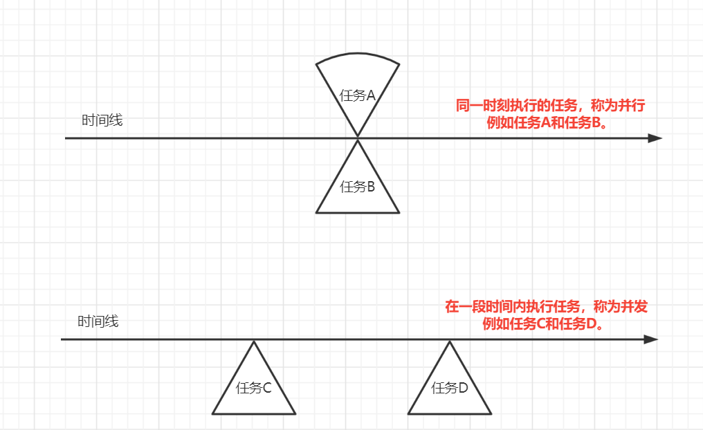
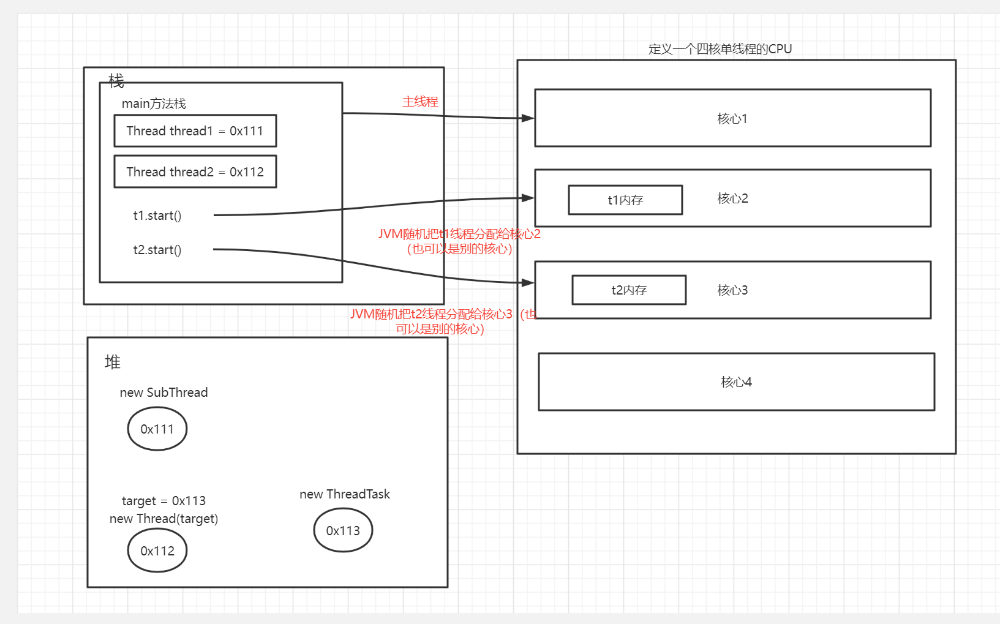
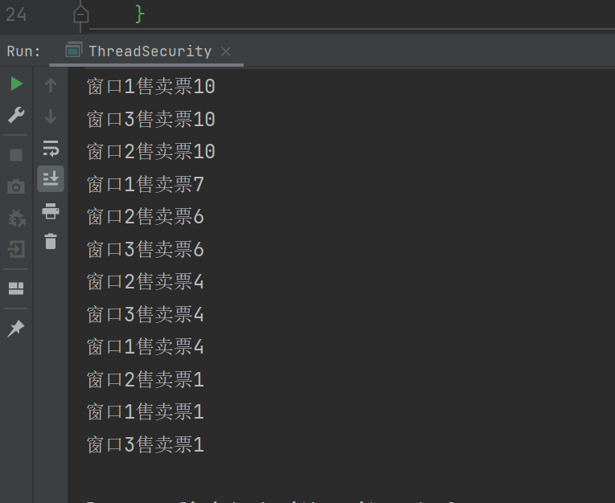
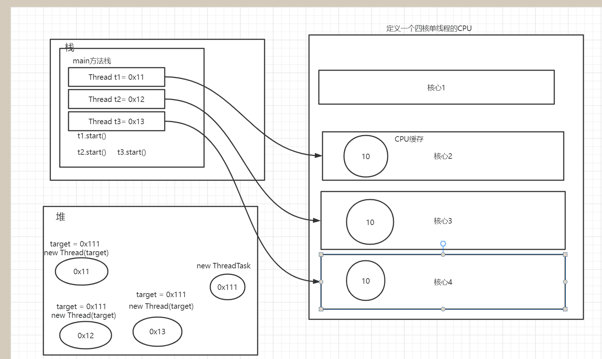
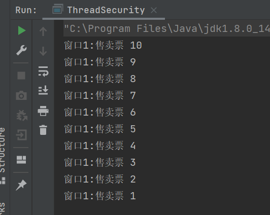
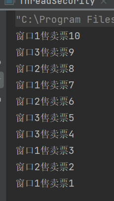

# 并发

[并发](https://docs.oracle.com/javase/tutorial/essential/concurrency/index.html "oracle官网解释并发")

> Computer users take it for granted that their systems can do more than one thing at a time. They assume that they can continue to work in a word processor, while other applications download files, manage the print queue, and stream audio. Even a single application is often expected to do more than one thing at a time
>
> 计算机用户认为他们的系统可以在同一事件做多件事情。他们假设自己在文字处理时，其他应用程序可以下载文件，管理打印队列和流音频。甚至一个应用程序经常被期望做不止一件事。
>
> The Java platform is designed from the ground up to support concurrent programming, with basic concurrency support in the Java programming language and the Java class libraries. Since version 5.0, the Java platform has also included high-level concurrency APIs. This lesson introduces the platform's basic concurrency support and summarizes some of the high-level APIs in the `java.util.concurrent` packages.
>
> 一开始设计Java平台就支持并发编程，在Java语言和Java类库中提供了基本的支持。版本5.0之后，Java平台还包含了高级的并发APIs，这节课程介绍了Java基本的并发支持，并总结了一些在`java.util.concurrent`的高级APIs。
>

在**并发**的概念中还包含**并行**，并行是并发的一种特殊情况



# 线程和进程

​[进程和线程](https://docs.oracle.com/javase/tutorial/essential/concurrency/procthread.html "Oracle官网对其的介绍")

> In concurrent programming, there are two basic units of execution: *processes* and  *threads* . In the Java programming language, concurrent programming is mostly concerned with threads. However, processes are also important.
>
> 在并发编程中，有两个基本执行单元：进程和线程。在Java编程中, 并发编程主要与线程有关。但进程也很重要.
>
> A computer system normally has many active processes and threads. This is true even in systems that only have a single execution core, and thus only have one thread actually executing at any given moment. Processing time for a single core is shared among processes and threads through an OS feature called time slicing.
>
> 计算机系通常有很多活动的进程和线程，即使只有一个执行核心也是如此，因此在任何给定时刻只有一个线程在实际执行。**单核执行时间，通过一个叫时间切片的OS功能在进程和线程之间共享。**
>
> It's becoming more and more common for computer systems to have multiple processors or processors with multiple execution cores. This greatly enhances a system's capacity for concurrent execution of processes and threads — but concurrency is possible even on simple systems, without multiple processors or execution cores.
>
> 计算机系统拥有多个处理器或处理器拥有多个执行核心正变得越来越普遍，这大大增强了系统同时执行进程和线程的能力---但是即使在没有多个处理器或执行核心的简单系统上，并发也是可能的。
>

## 进程

> A process has a self-contained execution environment. A process generally has a complete, private set of basic run-time resources; in particular, each process has its own memory space.
>
> 进程具有一个独立的执行环境。进程通常具有一个完整的，私有的基本运行时资源；特别是每个进程都有其自己的内存空间。
>
> Processes are often seen as synonymous with programs or applications. However, what the user sees as a single application may in fact be a set of cooperating processes. To facilitate communication between processes, most operating systems support *Inter Process Communication* (IPC) resources, such as pipes and sockets. IPC is used not just for communication between processes on the same system, but processes on different systems.
>
> 进程通常被视为程序或应用程序的同义词。然而，用户所看到的单个应用程序可能实际上是一组协作进程。为促进进程之间的通信，大部分操作系统支持进程间通信（IPC）资源，例如管道和套接字。IPC不仅被用与同一操作系统的进程之间的通信，而且还用于不同的系统的进程。
>
> Most implementations of the Java virtual machine run as a single process. 
>
> Java虚拟机的大多数实现都是作为单独的进程运行。
>

## 线程

> Threads are sometimes called  *lightweight processes* . Both processes and threads provide an execution environment, but creating a new thread requires fewer resources than creating a new process.
>
> 线程有时被称为轻量级进程。进程和线程都提供一个执行环境，但是创建新线程比创建新进程需要的资源更少。
>
> Threads exist within a process — every process has at least one. Threads share the process's resources, including memory and open files. This makes for efficient, but potentially problematic, communication.
>
> **线程存在于一个进程中----每个进程至少有一个****线程**。线程共享进程的资源，包括内存和打开的文件。这使得高效的通信，但也可能出现问题
>
> Multithreaded execution is an essential feature of the Java platform. Every application has at least one thread — or several, if you count "system" threads that do things like memory management and signal handling. But from the application programmer's point of view, you start with just one thread, called the  *main thread* . This thread has the ability to create additional threads.
>
> 多线程执行是Java平台一个必要的功能。每个应用程序拥有至少一个---或几个，如果算上"系统"线程所作的事，如内存管理和信号处理。但从应用程序程序员的角度看，你只开启了一个线程----其为主线程。这个线程拥有能力去创建额外的线程。
>

**总结**

* 进程拥有自己独立的内存空间，换言之就是计算机分配内存的单元是进程。线程在进程中，可以共享进程的资源，比如内存。
* 单个执行核心通过操作系统的时间分片来处理进程和线程之间的时间分配。

# 线程

## 线程创建方式

> *Provide a `Runnable` object.* The [`Runnable`](https://docs.oracle.com/javase/8/docs/api/java/lang/Runnable.html) interface defines a single method, `run`, meant to contain the code executed in the thread. 
>
> 提供一个可运行的对象。Runnable接口定义一个方法，run，意味着包含的代码在线程中执行。
>
> *Subclass `Thread`.* The `Thread` class itself implements `Runnable`, though its `run` method does nothing. 
>
> 子类线程。Thread类本身实现了Runnable，尽管他的run方法不执行任何操作。
>

## Thread类常用构造方法

```java
//创建一个线程
public Thread();
//创建一个带名字的线程
public Thread(String name);
//根据给定的线程任务创建一个线程
public Thread(Runnable target);
//根据给定的线程任务和名称创建线程
public Thread(Runnable target,String name);
```

## Thread常用成员方法

```java
//启动线程，但不一定会执行（表示该线程准备好了，执行由JVM调用完成，JVM会随机分配）
public synchronized void start();
//获取线程名
public final String getName();
//设置线程名
public synchronized void setName(String name);
//设置线程优先级
public final void setPriority(int newPriority);
//获取线程优先级
public final
//等待线程执行给定的时间（单位：毫秒）
public final synchronized void join(long millis) throws InterruptedException;
//获取线程ID
public long getId();
//获取线程状态
public State getState();
//检测线程是否被打断
public boolean isInterrupted();
//打断线程
public void interrup();
```

## 示例

```java
public class ThreadCreate {
    static class SubThread extends Thread{
        public SubThread(String name) {
            super(name);
        }
        @Override
        public void run() {
            System.out.println(getName() + "this is subThread");
        }
    }
    static class ThreadTask implements Runnable{
        @Override
        public void run() {
            Thread thread = Thread.currentThread();
            System.out.println(thread.getName() + "this is implementation");
        }
    }
    public static void main(String[] args) throws InterruptedException {
        Thread thread1 = new SubThread("extends");
        Thread thread2 = new Thread(new ThreadTask(),"implements");
        thread1.start();
        thread1.join();
        thread2.start();
    }
}
```

### 内存图



### 总结

创建线程的两种方式：实现`Runnable`和继承`Thread`类。更推荐实现`Runnable`，因为可继承多接口还能继承其他父类，避免了`Java`中单继承的局限性；同时`Runnable`接口的实现可以被多个线程所使用。后续的线程池中支持`Runnable`接口但不支持`Thread`。

```java
public class ThreadTask implements Runnable{
	@Override
        public void run() {
        }
}
public class ThreadTest {
    public static void main(String[] args) throws InterruptedException {
        ThreadTask task = new ThreadTask();
	//多个线程可以使用同一个任务
        Thread t1 = new Thread(task);
        Thread t2 = new Thread(task);
        Thread t3 = new Thread(task);
    }
}
```

## 线程安全

线程引发的安全问题

```java
public class ThreadSecurity {
    static class ThreadTask implements Runnable{
        private int totalTickets = 10;
        @Override
        public void run() {
            while (true){
                System.out.println(Thread.currentThread().getName() + "售卖票" +totalTickets);
                totalTickets--;
                if(totalTickets <= 0){
                    break;
                }
                try {
                    Thread.sleep(100L);
                } catch (InterruptedException e) {
                    e.printStackTrace();
                }
            }
        }
    }

    public static void main(String[] args) throws InterruptedException {
        ThreadTask task = new ThreadTask();
        Thread t1 = new Thread(task,"窗口1");
        Thread t2 = new Thread(task,"窗口2");
        Thread t3 = new Thread(task,"窗口3");
        t1.start();
        t2.start();
        t3.start();
    }
}
```

结果图



同一张票被卖了多次，这是由于线程之间获取信息不同步导致的。我们从内存图分析

### 内存图




cpu核心的执行速度非常快，内存与其的交互速度跟不上，因此会出现cpu缓存空间。

t1线程执行时，指向0x111内存空间，其里面存了个10，拿到他的CPU缓存空间，进行相关计算，计算后的结果写入0x111内存空间。同时t2、t3都在执行这样的操作，t1、t2、t3他们同时在0x111内存空间拿到10进入其相应的缓存空间进行计算操作，出现上述程序执行后情况。

## 线程同步-Synchronized

### 同步的语法

```java
访问修饰符 synchronized 返回值类型 方法名(参数列表){

}
```

### 使用

```java
public class ThreadSecurity {

    static class ThreadTask implements Runnable{
        private int totalTickets = 10;

	//成员方法上加同步锁，因此锁与成员有关
        @Override
        public synchronized void run() {
            while (true) {
                if (totalTickets > 0) {
                    System.out.println(Thread.currentThread().getName() + ":售卖票 " + totalTickets);
                    totalTickets--;
                } else {
                    break;
                }

                try {
                    Thread.sleep(10L);
                } catch (InterruptedException e) {
                    e.printStackTrace();
                }
            }
        }
    }

    public static void main(String[] args) throws InterruptedException {
        ThreadTask task = new ThreadTask(); //一个成员
        Thread t1 = new Thread(task,"窗口1"); //共用同一个成员
        Thread t2 = new Thread(task,"窗口2"); //共用同一个成员
        Thread t3 = new Thread(task,"窗口3"); //共用同一个成员
        t1.start();
        t2.start();
        t3.start();
    }
}
```

上述代码会造成如下结果



t1、t2、t3共用一个线程成员，现在情况就是 t1 拿到了锁，并锁住了此线程成员，一直执行到 break 的时候，也就是`totalTickets <= 0`才会释放锁。

### 改进

要实现多窗口使用同一线程成员，则锁需加在循环里面。

#### 方法1 定义一个synchronized方法，循环中调用它

```java
static class ThreadTask implements Runnable {
        private int totalTickets = 10;

        @Override
        public void run() {
            while (true) {
		this.lock();
		if(totalTickets <= 0){
		   break;
		}
        	   
                try {
                    Thread.sleep(10L);
                } catch (InterruptedException e) {
                    e.printStackTrace();
                }
            }
        }

        private synchronized void lock() {
            if (totalTickets > 0) {
                System.out.println(Thread.currentThread().getName() + "售卖票" + totalTickets);
                totalTickets--;
            }
        }


    }
```

#### 方法2 循环中写一个synchronized代码执行块

```java
    static class ThreadTask implements Runnable {
        public final static String YES = "yes";
        private int totalTickets = 10;

        @Override
        public void run() {
            while (true) {
                synchronized (this) {
                    if (totalTickets > 0) {
                        System.out.println(Thread.currentThread().getName() + "售卖票" + totalTickets);
                        totalTickets--;
                    }
                }

                if (totalTickets <= 0) {
                    break;
                }

                try {
                    Thread.sleep(10L);
                } catch (InterruptedException e) {
                    e.printStackTrace();
                }
            }
        }
```

上述两种方法都能实现不同窗口使用同一线程成员，执行结果



#### 内存分析


### synchronized锁实现原理

> Synchronization is built around an internal entity known as the *intrinsic lock* or  *monitor lock* . (The API specification often refers to this entity simply as a "monitor.") Intrinsic locks play a role in both aspects of synchronization: enforcing exclusive access to an object's state and establishing happens-before relationships that are essential to visibility.
>
> 同步是围绕在被称为 内部锁 或 监听锁的内部实体构建的。这API规范通常将此实体简称为监视器。内部锁
>
